# ℂℍ𝕀𝕄ℙ

Chimp is an image editor written in C++ and created using the [Qt](https://www.qt.io/) framework. This makes **Chimp** a portable tool, that can be used on either Linux, Windows or Mac OS.

**Contents of this README:**
* [Running CHIMP](#install)
* [Editor Layout](#layout)
* [Supported Sliders](#sliders)
* [Supported Tools](#tools)
* [Demo video](#video)

### Running CHIMP
- Install the QT library
- Clone the repo
- Run build.sh inside the repo 
- Run the executable CHIMP file

### Editor Layout
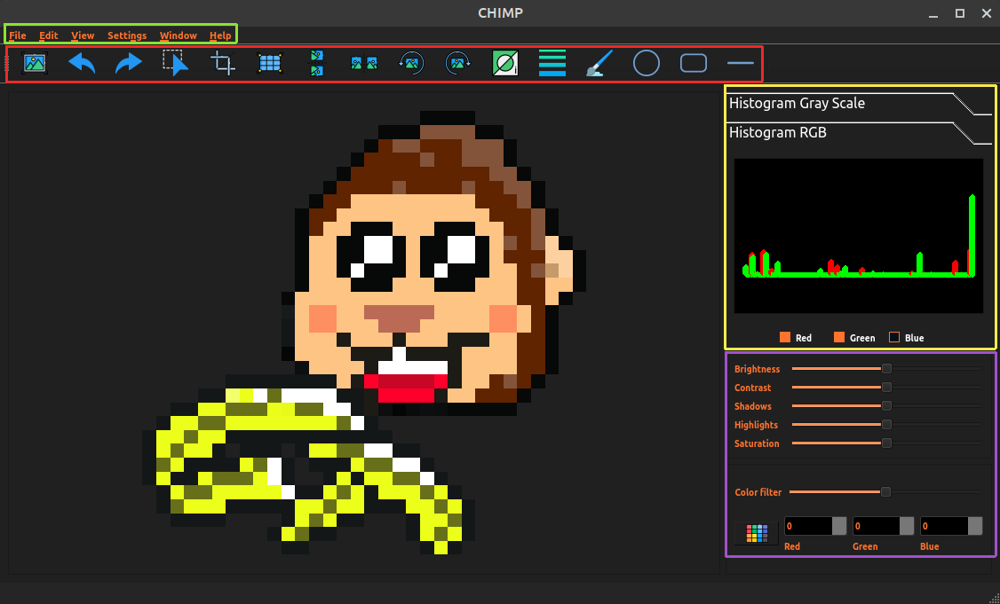

The explanation for each of the highlighted areas is as follows:
- The green area represents the menu bar with the usual selection of options:
  - Opening and saving image files
  - Changing the Theme of the editor
  - Undoing/redoing changes (the usual Ctrl+Z and Ctrl+Shift+Z shortcuts can be used)
  - Getting a list of supported shortcuts
- The red area contains non-slider tools available. For a full list of supported tools, read more [here](#tools)
- The yellow area contains histograms, either grayscale or RGB depending on which histogram has been selected. In the image editing context a color histogram is a representation of the distribution of colors.
- The magenta area contains adjustable sliders and color correction. For a full list of supported sliders, visit [this section](#sliders).

### Supported Sliders

- *Brightness* increases or decreases the brightness in a uniform way across the image
- *Contrast* adjusts the contrast of the image
- *Shadows* adjusts the intensity of darker colors in the image
- *Highlights* adjusts the intensity of lighter colors in the image
- *Saturation* adjusts image saturation
- *Correction* applies a colored filter of the selected color to the image

### Supported Tools

The editor supports the following editing tools:
<pre>
 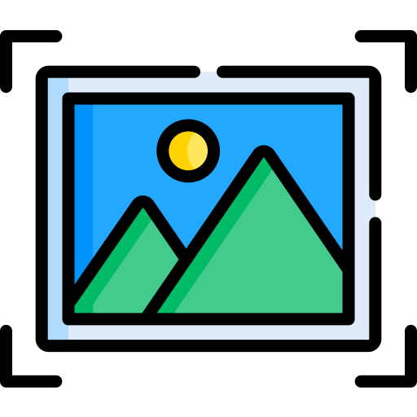➤ Open the image

 ➤ Undo

 ➤ Redo

 ➤ Select the image area

 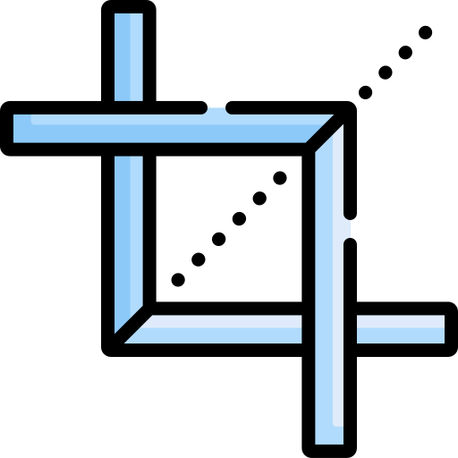➤ Crop the current image

 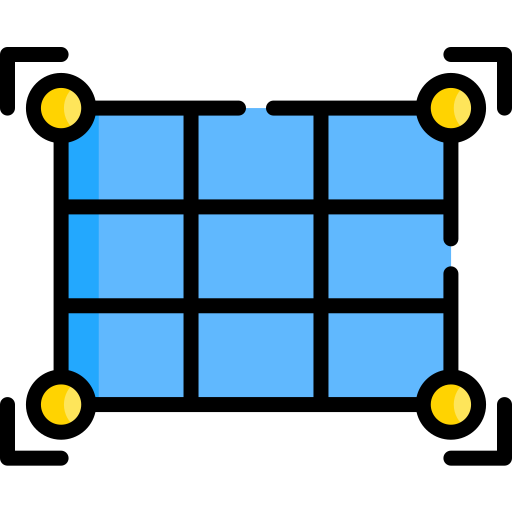➤ Resize the current image

 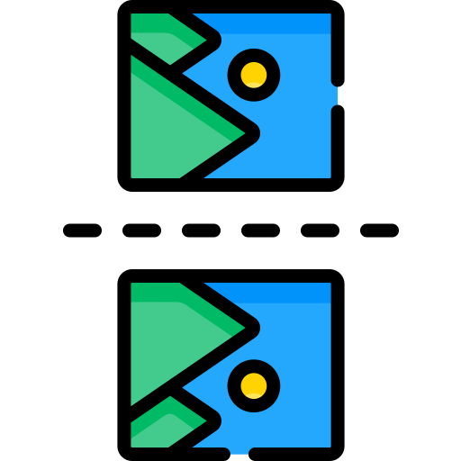➤ Flip the current image horizontally

 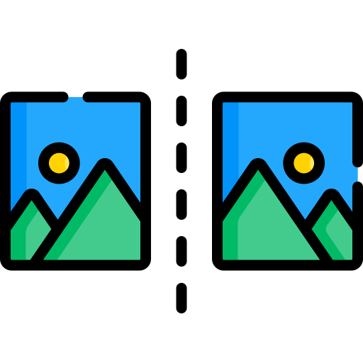➤ Flip the current image vertically

 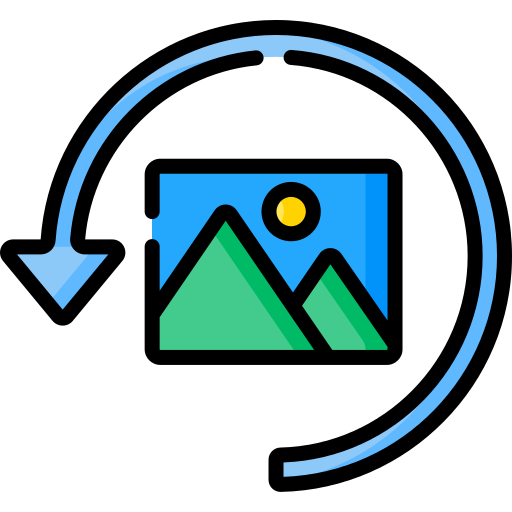➤ Rotate the current image to the left

 ➤ Rotate the current image to the right

 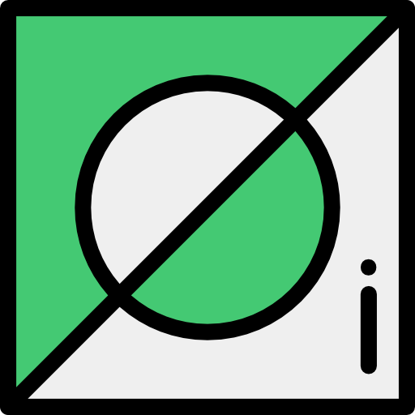➤ Apply a invert color effect to the current image

 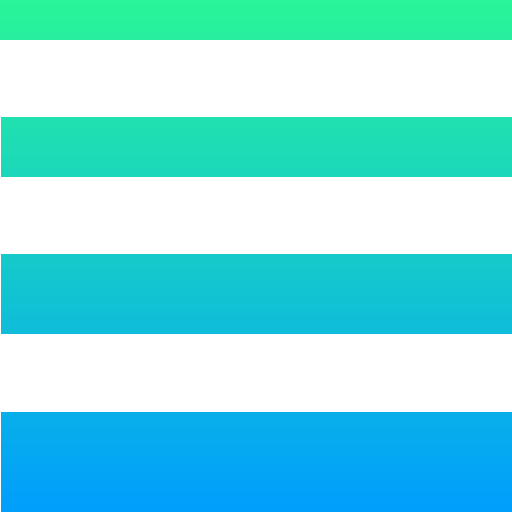➤ Brush style (width, opacity, color, square, gradient)

 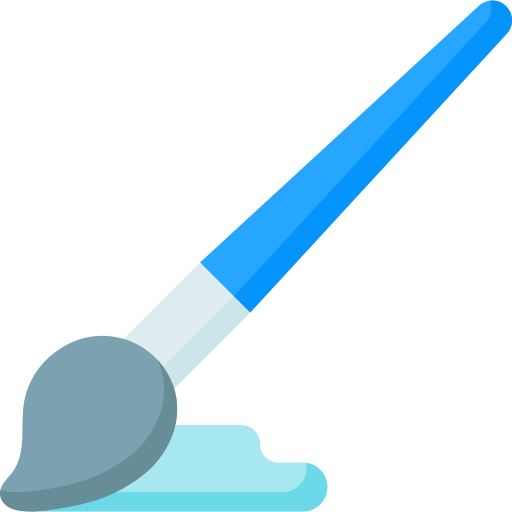➤ Freehand drawing on the current image

 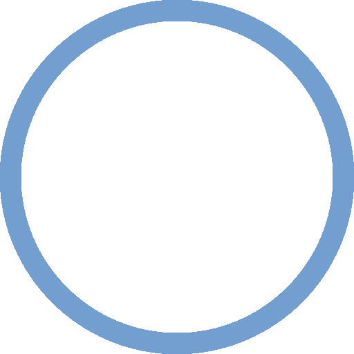➤ Drawing ellipses

 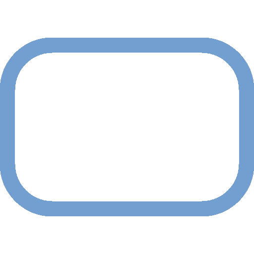➤ Drawing rectangles

 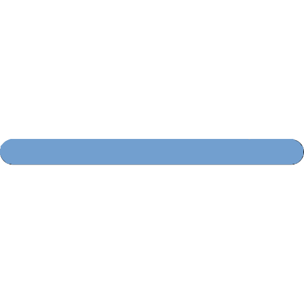➤ Drawing straight lines

 ➤ Choose freehand or shape drawing color

</pre>

### Demo video  

## Developers

- [Teodora Nickovic, 57/2016](https://gitlab.com/art3mida)
- [Kristina Popovic, 58/2016](https://gitlab.com/FriendlyBytes)
- [Zoran Vujicic, 158/2015](https://gitlab.com/z0cky)
- [Nemanja Tasic, 250/2014](https://gitlab.com/tasic92)
- [Dunja Spasic, 73/2016](https://gitlab.com/dunjx)
- [Olivera Popovic, 126/2016](https://gitlab.com/OliveraPopovic)
